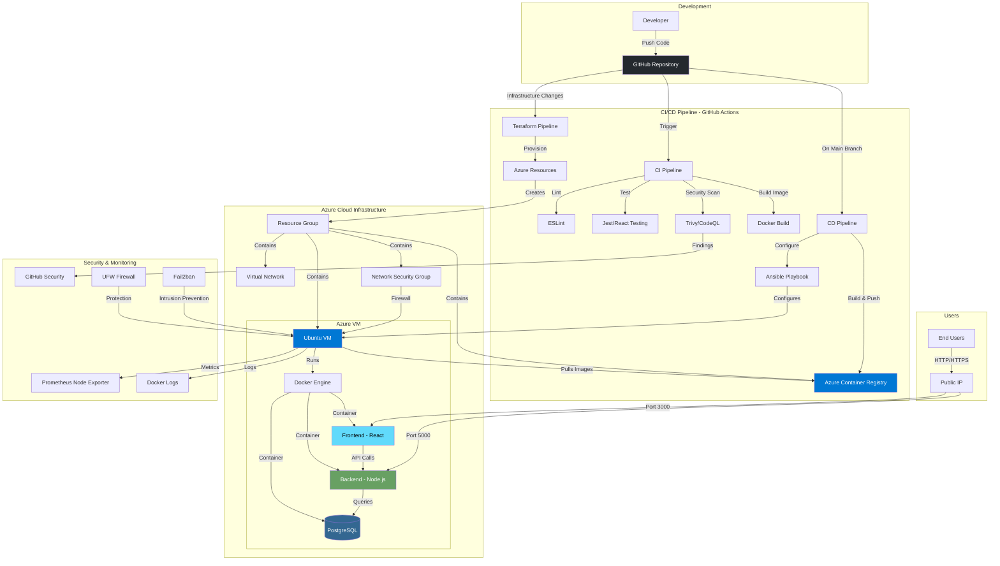

# DevOps Pipeline Task Manager - Architecture

## System Overview

The DevOps Task Manager is a cloud-native fullstack application demonstrating enterprise-level DevOps practices with complete CI/CD automation, infrastructure as code, and security integration.

## Architecture Diagram



## Technology Stack

### Frontend
- **Framework:** React 18
- **HTTP Client:** Axios
- **Styling:** CSS3
- **Build Tool:** Create React App
- **Web Server:** Nginx (in container)

### Backend
- **Runtime:** Node.js 18
- **Framework:** Express.js
- **Database Driver:** node-postgres (pg)
- **Security:** Helmet, CORS
- **Logging:** Morgan

### Database
- **DBMS:** PostgreSQL 15 (Alpine)
- **Connection:** Via Environment Variables
- **Persistence:** Docker Volumes

### Infrastructure
- **Cloud Provider:** Microsoft Azure
- **IaC Tool:** Terraform (with Terraform Cloud backend)
- **Configuration Management:** Ansible
- **Containerization:** Docker & Docker Compose
- **Container Registry:** Azure Container Registry (ACR)
- **Compute:** Azure Linux VM (Standard_B2s)
- **Networking:** Azure VNet, NSG, Public IP

### CI/CD
- **Platform:** GitHub Actions
- **Version Control:** Git/GitHub
- **Container Builds:** Docker Buildx
- **Deployment:** Ansible automated deployment

### Security Tools
- **SAST:** GitHub CodeQL
- **Dependency Scanning:** npm audit, Trivy
- **Container Scanning:** Trivy
- **Secret Scanning:** TruffleHog
- **IaC Security:** tfsec, Checkov
- **DAST:** OWASP ZAP
- **Firewall:** UFW, Azure NSG
- **Intrusion Prevention:** Fail2ban

### Monitoring
- **Metrics:** Prometheus Node Exporter
- **System Monitoring:** sysstat, htop
- **Application Logs:** Docker logs
- **Custom Scripts:** System status monitoring

## Network Architecture

### Azure Networking
- **Virtual Network:** 10.0.0.0/16
- **VM Subnet:** 10.0.1.0/24
- **Public IP:** Static allocation
- **DNS:** Azure-provided

### Network Security Group Rules

| Priority | Direction | Port | Protocol | Purpose |
|----------|-----------|------|----------|---------|
| 100 | Inbound | 22 | TCP | SSH Management |
| 110 | Inbound | 80 | TCP | HTTP Traffic |
| 120 | Inbound | 443 | TCP | HTTPS Traffic |
| 130 | Inbound | 3000 | TCP | Frontend Application |
| 140 | Inbound | 5000 | TCP | Backend API |

### Application Ports

```
3000 (Frontend) ← Users access React app
5000 (Backend) ← API requests from frontend
5432 (PostgreSQL) ← Internal only, not exposed
9100 (Node Exporter) ← Monitoring metrics
```

## Data Flow

### User Request Flow
1. User accesses `http://VM_IP:3000`
2. Nginx serves React static files
3. React app makes API calls to `http://VM_IP:5000`
4. Express backend processes request
5. Backend queries PostgreSQL database
6. Response flows back through the chain

### Deployment Flow
1. Developer pushes code to GitHub
2. CI pipeline runs (lint, test, security scan)
3. On merge to main:
   - CD pipeline triggered
   - Docker images built and tagged
   - Images pushed to ACR
   - Ansible connects to VM via SSH
   - Ansible configures VM (security, docker, monitoring)
   - Ansible deploys application via docker-compose
   - Health checks verify deployment
4. Application accessible to users

### Infrastructure Provisioning Flow
1. Terraform configuration pushed to main
2. Terraform pipeline triggered
3. Terraform Cloud executes plan
4. Resources provisioned in Azure:
   - Resource Group created
   - Virtual Network configured
   - NSG rules applied
   - Public IP allocated
   - VM provisioned
   - ACR created
   - IAM roles assigned
5. Outputs saved for CD pipeline use

## Security Architecture

### Defense in Depth Layers

**Layer 1: Code Security**
- ESLint for code quality
- CodeQL for vulnerability detection
- Dependency scanning
- Secret scanning

**Layer 2: Container Security**
- Multi-stage Docker builds
- Minimal base images (Alpine)
- Trivy vulnerability scanning
- No root containers

**Layer 3: Network Security**
- Azure NSG filtering
- UFW firewall on VM
- Minimal port exposure
- Private network for database

**Layer 4: Application Security**
- Helmet security headers
- CORS configuration
- Input validation
- Environment-based secrets

**Layer 5: Infrastructure Security**
- tfsec for Terraform
- SSH-only authentication
- System-assigned managed identity
- Principle of least privilege

**Layer 6: Runtime Security**
- Fail2ban intrusion prevention
- Automatic security updates
- Resource limits
- Docker daemon hardening

## High Availability Considerations

### Current Architecture (Dev/Test)
- Single VM deployment
- Single database instance
- No load balancing

### Production Recommendations
- Azure VM Scale Sets
- Azure Load Balancer
- PostgreSQL managed service (Azure Database)
- Azure Container Instances or AKS
- Redis for session management
- Azure Application Gateway with WAF
- Multi-region deployment

## Scalability

### Horizontal Scaling Options
1. Multiple VM instances behind load balancer
2. Containerize on Azure Kubernetes Service (AKS)
3. Move to Azure App Service
4. Implement caching layer (Redis)

### Vertical Scaling
- Current: Standard_B2s (2 vCPU, 4GB RAM)
- Can scale to larger VM sizes
- Database can scale independently

## Monitoring & Observability

### Metrics Collected
- CPU, Memory, Disk usage
- Container health status
- Application response times
- HTTP request logs
- Database connections

### Health Checks
- Backend: `/health` endpoint
- Frontend: Nginx status
- Database: `pg_isready`
- Container: Docker healthcheck

## Disaster Recovery

### Backup Strategy
- Database: Volume persistence
- Code: Git repository
- Infrastructure: Terraform state in cloud
- Configuration: Ansible playbooks in Git

### Recovery Procedures
1. Infrastructure: `terraform apply` to recreate
2. Configuration: Ansible playbooks to reconfigure
3. Application: CD pipeline redeploys latest
4. Database: Manual backup/restore if needed

## Cost Optimization

### Current Monthly Costs (Approximate)
- VM (Standard_B2s): ~$30
- ACR (Basic): ~$5
- Public IP: ~$3
- Storage: ~$2
- **Total: ~$40/month**

### Cost Reduction Strategies
- Stop VM when not in use
- Use Azure Dev/Test pricing
- Implement auto-shutdown
- Optimize container image sizes

## Future Enhancements

1. **Kubernetes Migration**
   - Move to AKS for orchestration
   - Implement Helm charts
   - Add horizontal pod autoscaling

2. **Enhanced Monitoring**
   - Azure Monitor integration
   - Application Insights
   - Custom dashboards

3. **Advanced Security**
   - Azure Key Vault for secrets
   - Managed identity for all auth
   - Web Application Firewall

4. **CI/CD Improvements**
   - Canary deployments
   - Blue-green deployments
   - Automated rollback

5. **Performance**
   - CDN for static assets
   - Database connection pooling
   - API response caching

---

**Last Updated:** November 2025  
**Architecture Version:** 1.0
